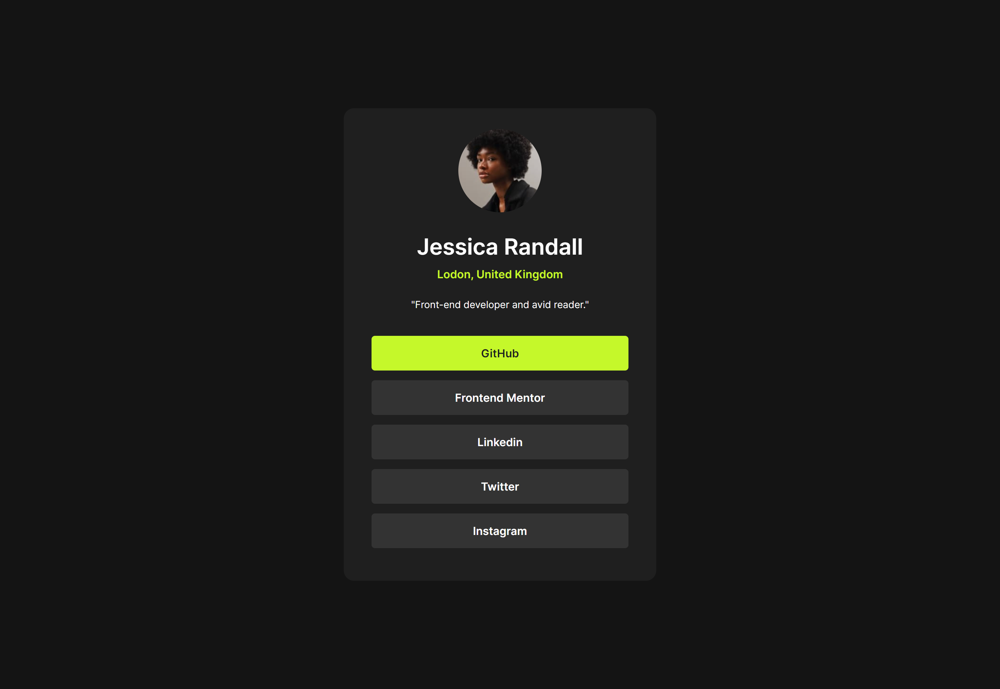

# Frontend Mentor - Social links profile solution
This is a solution to the [Social links profile challenge on Frontend Mentor](https://www.frontendmentor.io/challenges/social-links-profile-UG32l9m6dQ). Frontend Mentor challenges help you improve your coding skills by building realistic projects. 

## Table of contents
- [Overview](#overview)
  - [The challenge](#the-challenge)
  - [Screenshot](#screenshot)
  - [Links](#links)
- [My process](#my-process)
  - [Built with](#built-with)
  - [Useful resources](#useful-resources)
- [Author](#author)

## Overview
### The challenge

Users should be able to:

- See hover and focus states for all interactive elements on the page

### Screenshot

### Links
- Solution URL: [https://www.frontendmentor.io/solutions/responsive-social-links-profile-YsHweXB_nA](https://www.frontendmentor.io/solutions/responsive-social-links-profile-YsHweXB_nA)
- Live Site URL: [https://7r0n1x.github.io/social-links-profile/](https://7r0n1x.github.io/social-links-profile/)

## My process
### Built with
- Semantic HTML5 markup
- CSS custom properties
- Flexbox
- Mobile-first workflow

### Useful resources
- [Responsive Web Design - Media Queries](https://www.w3schools.com/css/css_rwd_mediaqueries.asp)

## Author
- Frontend Mentor - [@7R0N1X](https://www.frontendmentor.io/profile/7R0N1X)
